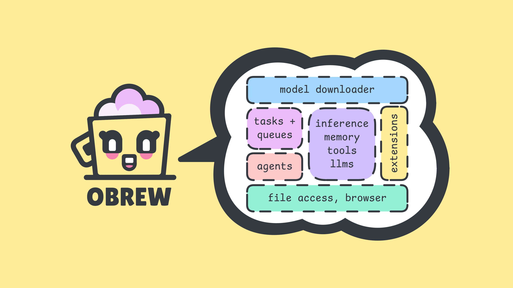
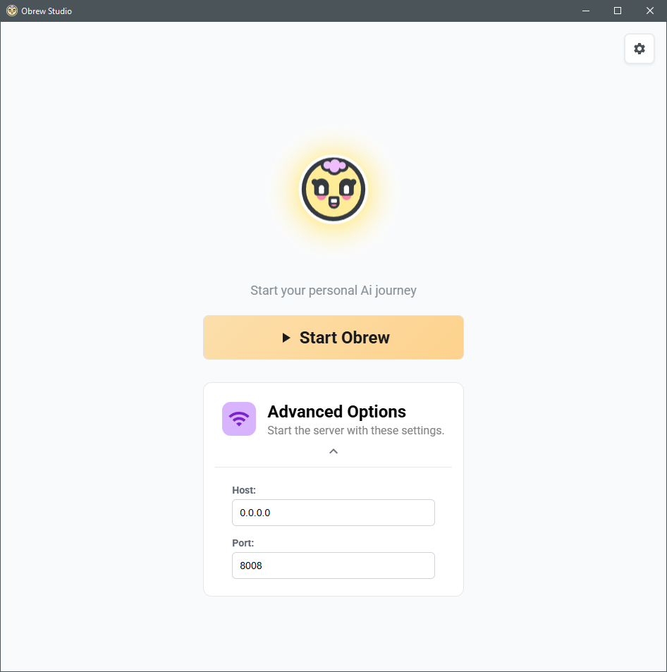
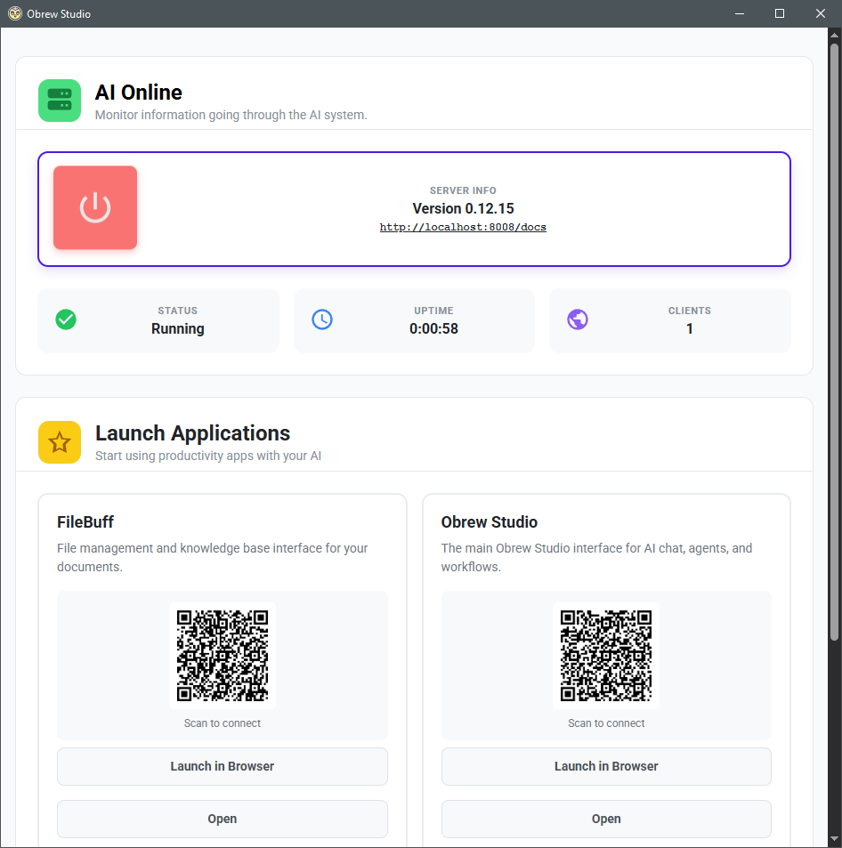
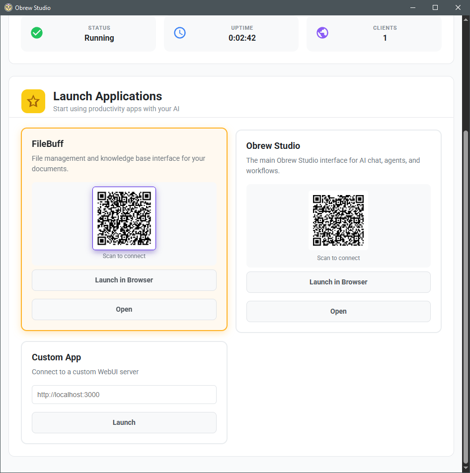
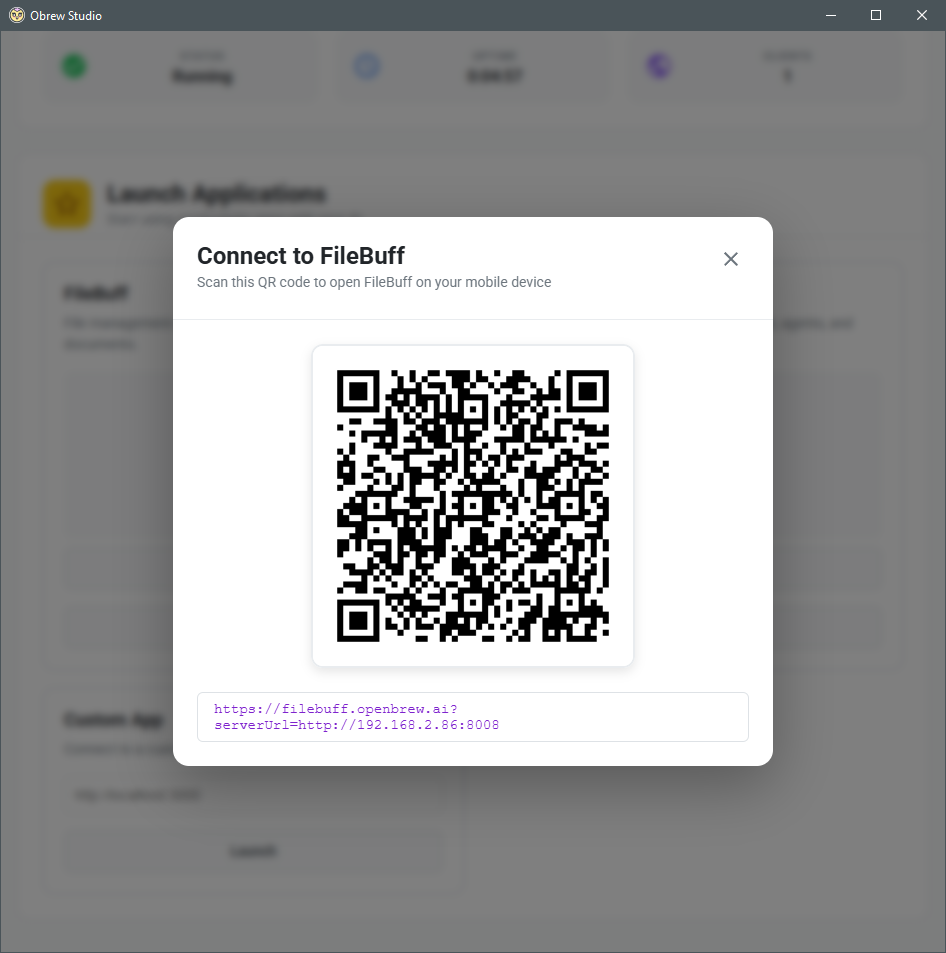

<h3 align="center">
    OpenBrew - Your Personal Ai Engine
</h3>

<h3 align="center">
    
     
     
    A general purpose tool for building private Ai desktop apps.
     
     
    
    
    
    
</h3>

## Table of Contents

- [Supported Models](https://huggingface.co/models?library=gguf&sort=trending)
- [Features](#app-features-roadmap)
- [How to Use](assets/how-to-use.md)
- [Quick Start Guide](assets/quick-start.md)
- [Getting Started](assets/getting-started.md)
- [How to Connect Apps](assets/how-to-connect-apps.md)
- [API Documentation](assets/api-docs.md)
- [Build Steps](assets/build-steps.md)
- [Bundling for Release](assets/bundling-for-release.md)
- [Deploy](assets/deploy.md)
- [FAQ](assets/faq.md)

## Introduction

The goal of this project is to be an all-in-one solution for running local Ai that is easy to install, setup and use. It handles all basic building blocks of Ai: inference, memory retrieval (RAG) and storage (vector DB), model file management, and agent/workflow building.

https://github.com/user-attachments/assets/1aadbc35-b1bd-4489-996d-aea31f6171d6

## Description

OpenBrew is a native app with a GUI that can be configured to allow access from other apps you write or third party services, making it an ideal engine for Ai workloads built on your own tech stack.

    
    

## How It Works

This backend runs a web server that acts as the main gateway to the suite of tools. A WebUI is provided called [OpenBrew: WebUI](https://studio.openbrew.ai/) to access this server. You can also run in headless mode to access it programmatically via the API.

    
    

### To use Ai locally with your private data for free:

- Launch the desktop app and choose an app to start using
- or navigate your browser to any web app that supports the API
- or connect with a service provider or custom stack that supports the OpenBrew API

## Minimum Hardware Requirements

- 8GB Disk space
- 4GB Memory

## App Features Roadmap

✅ Run locally 
✅ Windows OS installer 
✅ MacOS installer 
✅ Save chat history 
✅ CPU & GPU support 
❌ Linux installer 
❌ Production ready: This project is under active development 

## Ai Features Roadmap

✅ Inference: Run open-source LLM models locally 
✅ Embeddings: Create vector embeddings from a file/website/media to augment memory 
✅ Knowledge Base: Search a vector database with Llama Index to retrieve information 
✅ Agents: Customized LLM, can choose or specify tool use 
✅ Tool Use: Choose from pre-made or write your own 
✅ Multi-modal:

- ✅ image
- ✅ text
- ❌ video
- ❌ audio
- ❌ 3d
   

❌ Observability: Source citations, logging, tracing 
❌ Cached Context & Extended Context 
❌ Voice-to-Text and Text-to-Speech 

<!-- ❌ Multi-device memory sharing (i.e. cluster of macs running single large model)  -->

## Supported Model Providers

This is a local first project. The ultimate goal is to support many providers via one API.

✅ [Open-Source (GGUF format)](https://huggingface.co) 
❌ [Google Gemini](https://gemini.google.com) 
❌ [OpenAI](https://openai.com/chatgpt) 
❌ [Anthropic](https://www.anthropic.com) 
❌ [Mistral AI](https://mistral.ai) 
❌ [Groq](https://groq.com) 

## Learn More

- Backend: [FastAPI](https://fastapi.tiangolo.com/) - learn about FastAPI features and API.
- Inference: [llama-cpp](https://github.com/ggerganov/llama.cpp) for LLM inference.
- Memory: [ChromaDB](https://github.com/chroma-core/chroma) for vector database.
- WebUI: React for front-end UI and [Pywebview](https://github.com/r0x0r/pywebview) for rendering the webview.
