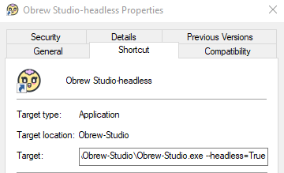

# Getting Started for Developers

## Running the release executable

If you get a "Permission Denied" error, try running the executable with Admin privileges.

There are two shortcuts installed, the normal executable and one for "headless" mode. In headless mode the backend will run in the background without a GUI window. This is ideal for automation or development since you can use command line arguments to specify how you run the service:

- --host=0.0.0.0
- --port=8008
- --headless=True
- --mode=dev or prod (this enables/disables logging)

You can also append these to the shortcut's "Target", just use one dash.



## Run/Build from source code

### Install Python dependencies

Install dependencies for python listed in requirements.txt file:

Be sure to run this command with admin privileges. This command is optional and is also run on each `pnpm build`.

```bash
pip install -r requirements.txt
# or
pnpm python-deps
```

### Install yarn | npm | pnpm | etc.

It is not strictly required to install one of these package managers unless you require linting or webdev dependencies for any UI you may build. All the terminal examples in this readme use it as conveniance to call specific scripts from `package.json` but you may run them manually from the terminal if you wish.

### Start the backend

Right-click over `backends/main.py` and choose "run python file in terminal" to start server:

Or

```bash
# from working dir
python backends/main.py
```

Or using a package manager

```bash
pnpm dev
# or
pnpm prod
# or to run headless (production)
pnpm headless-prod
# or to run headless (development)
pnpm headless-dev
```

The Obrew api server will be running on [https://localhost:8008](https://localhost:8008)

\*_Note_ if the server fails to start be sure to run `pnpm makecert` command to create certificate files necessary for https (these go into `_deps/public` folder).

## Managing Python dependencies

It is highly recommended to use a package manager like Anaconda to manage Python installations and the versions of dependencies they require. This allows you to create virtual environments from which you can install different versions of software and build/deploy from within this sandboxed environment.

To update PIP package installer:

```bash
conda update pip
```

### Create/Switch between virtual environments (Conda)

The following commands should be done in `Anaconda Prompt` terminal. If on Windows, `run as Admin`.

1. Create a new environment. This project uses `3.12.3`:

```bash
conda create --name env1 python=3.12
```

2. To work in this env, activate it:

```bash
conda activate env1
```

3. When you are done using it, deactivate it:

```bash
conda deactivate
```

4. If using an IDE like VSCode, you must apply your newly created virtual environment by selecting the `python interpreter` button at the bottom when inside your project directory.

### Create/Switch between virtual environments (venv)

venv is the recommended tool for creating virtual environments for Python v3.6 and up. You should always switch environments when working or pyinstalling a different binary (launcher versus app).

\* Note If using VS Code you may need to set the interpreter (while in a py file, click the interpreter button at the bottom, navigate to `.venv/Scripts/python.exe`)

1. Create a new environment:

```bash
python -m venv .venv
```

2. Activate the environment:

```cmd
.venv/Scripts/activate.bat
```

OR

```powershell
.venv/Scripts/Activate.ps1
```

OR on MacOS/Linux

```bash
source .venv/bin/activate
```

3. Install dependencies:

```bash
pip install -r requirements.txt
```

[Back to README](../README.md)
